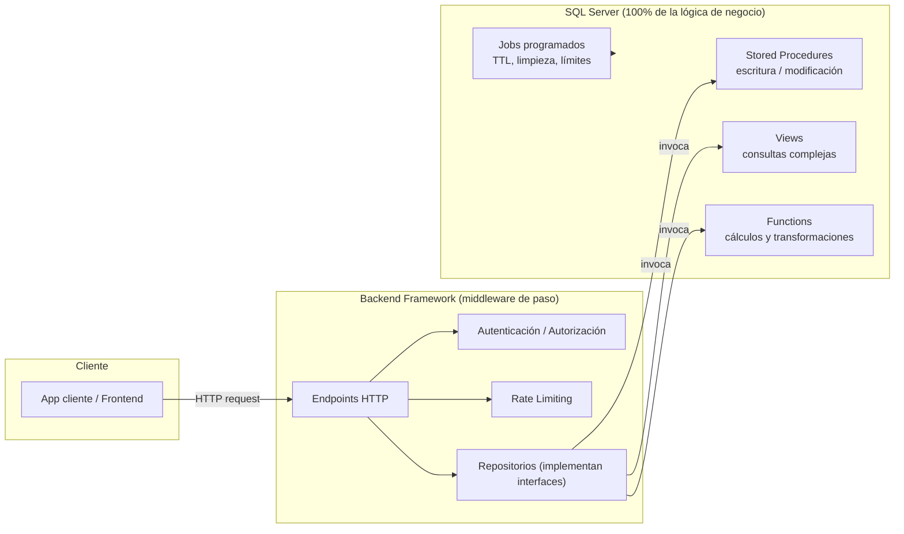
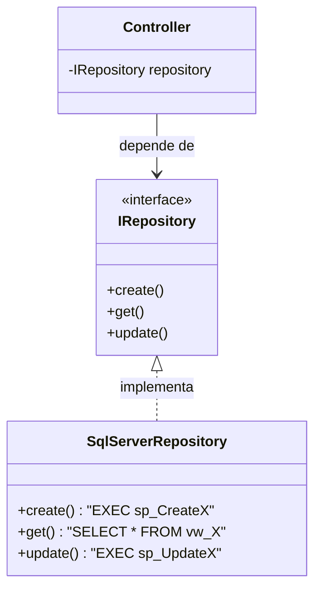

# Arquitectura del sistema

Raft DB sigue un enfoque **Database-Centric**: la base de datos concentra el 100% de la lógica de negocio y el backend actúa únicamente como middleware de paso (mediador, despachador y asegurador de la comunicación).

## Diagrama general

## Roles de cada componente

### Motor de base de datos (SQL Server)

Almacena los datos y ejecuta el 100% de la lógica de negocio mediante:

- **Stored Procedures (SPs)** para operaciones de escritura/modificación.
- **Views** para consultas complejas.
- **Functions** para cálculos o transformaciones de datos.

Ver el catálogo y convenciones en [Stored Procedures](./stored-procedures.mdx).

### Backend Framework (a elección del equipo)

Actúa como un middleware de paso:

- Expone los endpoints HTTP.
- Gestiona autenticación/autorización.
- Aplica políticas de tráfico (Rate Limiting).
- Mapea los resultados de la base de datos hacia el cliente.

:::danger Regla de oro
Ninguna regla de validación compleja, cálculo, asignación de permisos o flujo de negocio se escribe en el código del servidor de aplicaciones.
:::

## Patrón Repositorio con Inversión de Dependencias (DIP)

Para garantizar mantenibilidad y desacoplamiento en el backend:

1. El backend define **interfaces/contratos** claros para las operaciones de persistencia (por ejemplo, `IDatabaseProvisioningRepository`, `IUsageRepository`).
2. La **implementación concreta** del repositorio solo se encarga de invocar los Stored Procedures o Views correspondientes en SQL Server — no contiene lógica de negocio propia.
3. Controladores y servicios dependen **únicamente de la abstracción** (la interfaz), nunca de la implementación concreta, cumpliendo el principio DIP de SOLID.

Esto permite, por ejemplo, cambiar de framework de backend (de .NET a NestJS o Laravel) sin tocar la lógica de negocio, porque esta nunca vivió en el backend.

## Stack tecnológico

| Capa | Tecnología |
|---|---|
| Base de datos | Microsoft SQL Server |
| Backend | A elección del equipo (recomendado: .NET Web API, NestJS o Laravel) |
| Documentación | Docusaurus (este sitio) |

## Próximos pasos de esta sección

- [ ] Documentar el diagrama entidad-relación (ERD) del modelo de datos una vez definido.
- [ ] Añadir diagramas de secuencia para los flujos críticos (aprovisionamiento de BD, TTL/expiración, límite de almacenamiento).
- [ ] Confirmar el framework de backend elegido y actualizar esta página.
